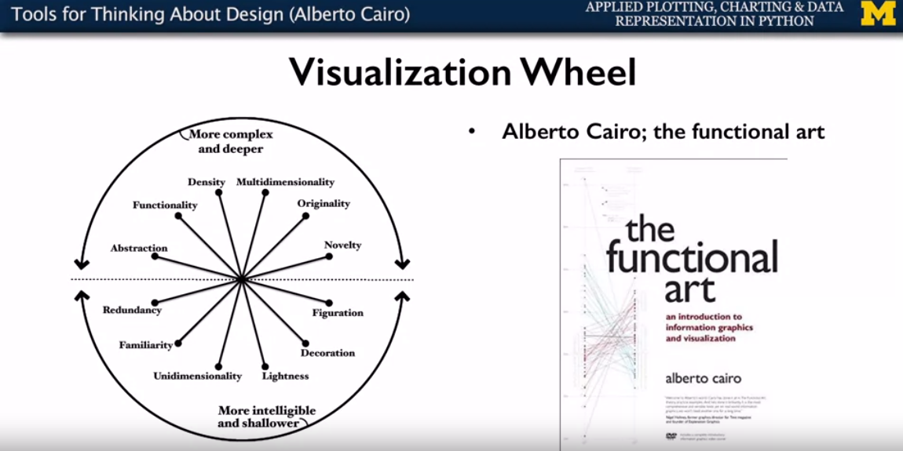
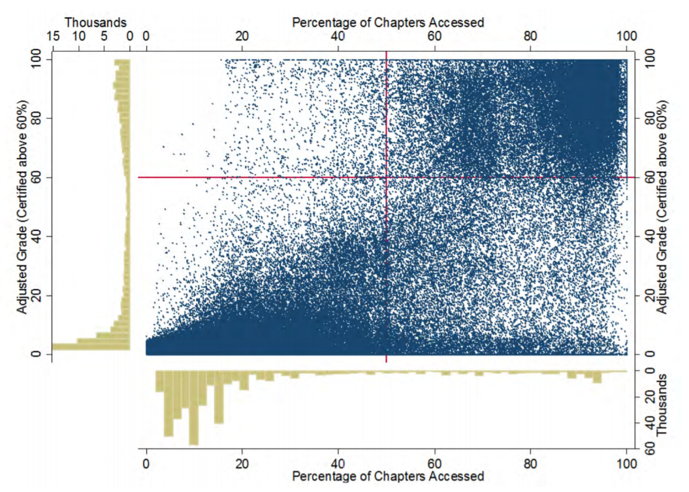

## 1. Tools for thinking about design (Alberto Cairo)

In his book, the Functional Art, Alberto Cairo provides a tool for thinking about design tradeoffs when building information graphics, and he calls this tool the __Visualization Wheel__.

In this conceptualization there are __two poles of a circle__. __The top one represents highly complex data which informs at a deep level. While the bottom provides easier access to data but only informs in a shallow manner.__ Inside the circle are dimensions which describe tradeoffs between two approaches. While Cairo provides a number of interesting dimensions. It's important to note that this is a tool for designers to think about their visualizations. And not so much an analytics tool itself. Your needs from any particular problem might change which of these dimensions are important or might introduce new dimensions which you should be thinking about. Cairo actually suggests a role in an organization or a professional background might also influence the kinds of graphics we want to make.

Look at a few of the trade offs that Cairo considers:  

1. The first is __abstraction and figuration__. A highly figurative visual describes the phenomenon using physical representations of the phenomena, such as photographs or drawings. As the representations become less real and more conceptual, the emphasis shifts from figuration to abstraction.
- Boxes and charts (abstraction) or real-world physical objects (figuration)

2. The second dimension is, __functionality and decoration__. A completely functional graphic has no embellishments and is closer to a direct representation of the data. While a heavily decorated graphic has more artistic embellishments.
- No embellishments (functionality) or artistic embellishments (decoration)

As it is with all of these dimensions, there isn't a clear better or worse. Embellishments may increase the amount of time a viewer spends considering the visual. Exploring it's nuances and forming mental associations which may increase familiarity and memorability.

3. The third dimension is __density and lightness__ as they relate to the amount of information being shown. 
- Must be studied in depth (density) or understandable at a glance (lightness)  

There are lots of great examples of this in scientific visuals, where some figures are intended to be studied in depth, while others are meant to quickly augment a narrative. You can see this dimension at play when comparing magazine infographics, where the reader is likely to be more heavily engaged in the content. Two advertisements in the same magazine where readers are likely to only quickly consider an ad.

4. The fourth aspect Cairo maps is the __dimensionality of the graphic__. A multidimensional graphic describes a phenomena as a whole and invites the viewer to explore many different aspects of the phenomena. A unidimensional graphic instead focuses on a single or a few items and explores them in one or more ways.

5. The fifth dimension is __originality and familiarity__. In the modern world, we're used to seeing a plethora of different kinds of information graphics, things like bar charts and line charts. And thinking in terms of these representations is taught at a very young age. Eg: Election results, match statistics, etc.

6. The last dimension which Cairo shares is the __novelty and redundancy dimension__. __Redundancy__ is the tendency of a graphic to tell the same story in many different ways. For instance, you might use the height of bars on a bar chart with an axis as well as color to emphasize the largest bar. This one's a bit tricky, you don't want to bore your readers or make your graphics overly complex. But you do want to encode information in a way which supports their understanding of the phenomena you've described. On this dimension, __novelty__ is the act of describing each phenomena in the graphic in only one way.

There are no rights and wrongs in the visualization wheel. The purpose of the wheel is to help you understand and compare the visual approaches you might take. As a reflective activity, Cairo suggested you can plot your thinking, a long each of these dimensions and then join those points together, to create a radar plot.

Applied the learnings from above to this: https://mooctools.ai.umich.edu/multimeasure/424-visualization-wheel-practice/68-radiation-dose-chart/cbe0b0e1e45ccb1434653effcecbaf3263952f42/

## 2. Graphical heuristics: Data-ink ratio (Edward Tufte)

First, what's a heuristic? A heuristic is a process or rule that is meant to guide you in decision making. Is by definition not known to be optimal or perfect, but to be practical in nature. Heuristics are meant to be followed until you've a reason to deviate from them. Tufte's first graphical heuristic is data-ink ratio.

__Data-ink ratio__: the amount of data-ink divided by the total ink required to print the graphic.

Another heuristic which Edward Tufte introduces us to is called chartjunk. Now Tufte is much more damning of chartjunk than he is of other forms of non-data ink. Indeed, he suggests that artistic decorations on statistical graphs are like weeds in our data graphics.  

 There are three kinds of __chartjunk__. 
- The first is __unintended optical art__.For instance, excessive shading or patterning of chart features . Tufte suggests that instead of patterning this content, one is better off labeling the chart graphics directly.
- The second form of chartjunk is the grid. Tufte suggested the grid is both unnecessary as data ink, but also causes competition with the actual data being shared.
Thinning, removing, or desaturating grid lines makes it easier to see the data, instead of being overwhelmed by the number of lines on the page. 
Direct labeling of data is another great way to reduce this form of chartjunk. 

-  third form of chartjunk: non-data creative graphics, whether they be line art or photographs and they're inclusion in the chart.
 
## 3. Graphical heuristics: Lie Factor and Spark Lines (Edward Tufte)
 
 __Sparklines__ are used for data where trends or distribution characteristics are important. 

__Lie factor__ is the size of an effect shown in the graphic divided by the size of the effect actually in the data. It's often done unconsciously, to try and help tell a narrative, however, it's misleading to the observers.

## 4. The Truthful Art (Alberto Cairo)

Alberto Cairo's book, The Truthful Art to be required reading for any data scientist.  

### 5. Qualities of a Great Visualization 
1. Truthful – Be aware of your actions when cleaning, summarizing and manipulating data and ensure you aren’t 
             • Misleading yourself (self deception)
             • Misleading your audience 

2. Functionality 
3. Beauty 
4. Insightful  

